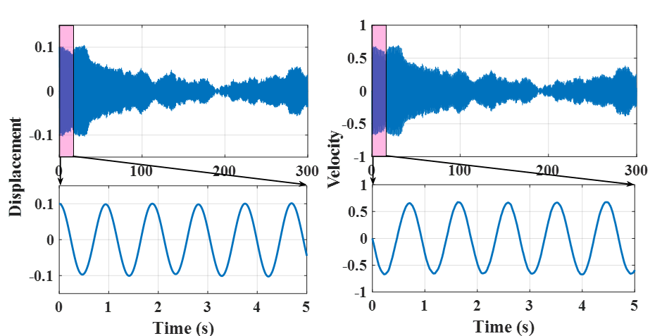
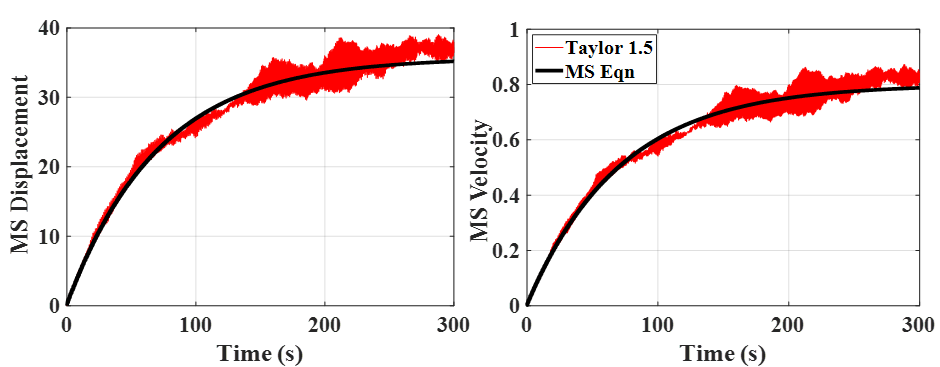

# BTP
Predicting response of beam systems subjected to random vibrations. Simulation code and comparison with Ito-Taylor 1.5 numerical technique.

Response of system.

Comparison of Numerical and Analytical Technique
