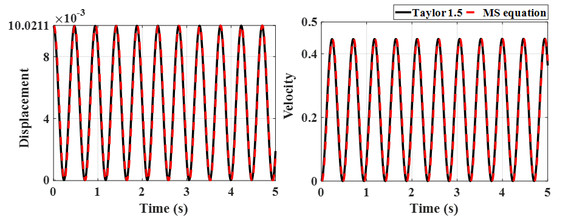

# BTP
Predicting response of beam systems subjected to random vibrations and developing vibration control algorithm. Simulation code and comparison with Ito-Taylor 1.5 numerical technique.

1.Response of system.

2.Comparison of Numerical and Analytical Technique

